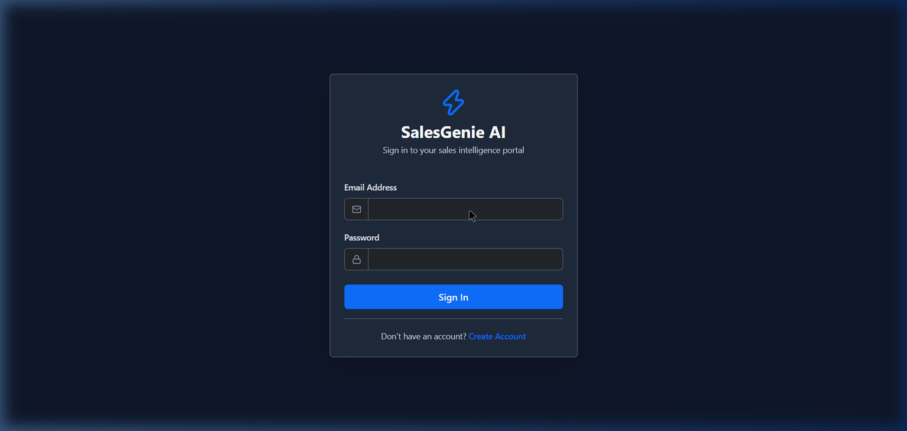
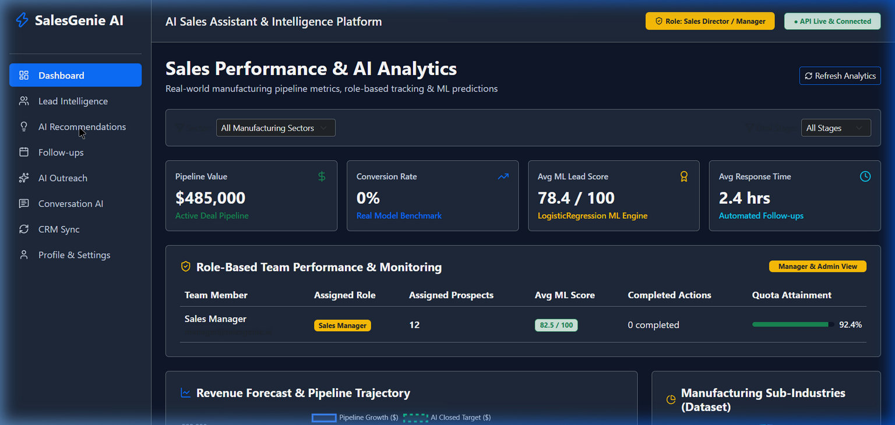
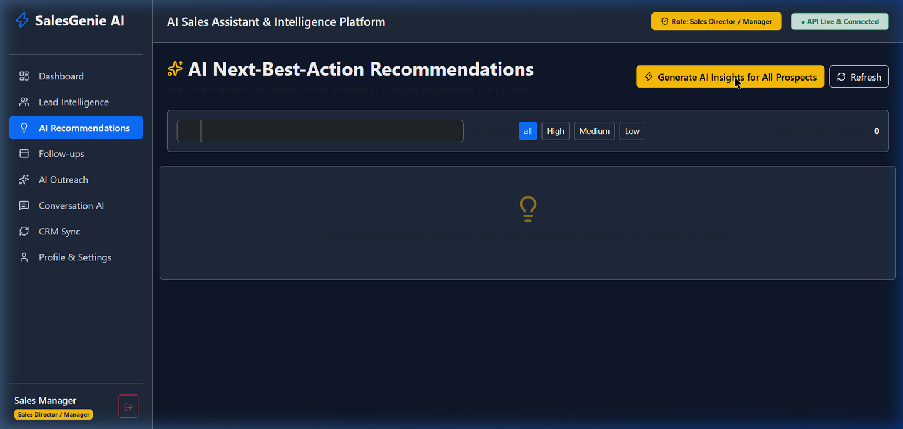
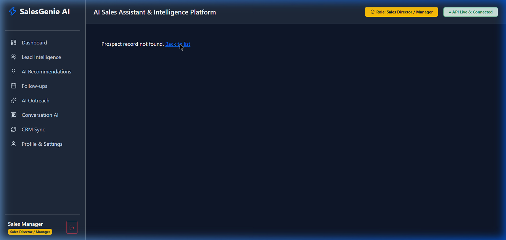

# ⚡ SalesGenie AI — B2B Manufacturing Sales Intelligence & Prospect Qualification Engine

> **SalesGenie AI** is a state-of-the-art enterprise AI/ML platform designed for B2B industrial manufacturing companies. It leverages real-world sales pipeline datasets and scikit-learn Machine Learning pipelines to deliver automated lead qualification, revenue forecasting, role-based performance monitoring, and hyper-personalized outreach.

---

## 📸 Application Screenshots & Interface Showcase

### 🔐 1. User Authentication & Login Page
*Secure JWT authentication interface with Role-Based Access Control (RBAC) entry.*


---

### 📊 2. Sales Performance Dashboard & Analytics
*Real-time pipeline analytics, manufacturing sub-industry breakdown chart, deal stage funnel, and top ML qualified prospects.*


---

### 💡 3. AI Recommendations
*ML-driven recommendation cards prioritized by High, Medium, and Low action impact with one-click resolution.*


---

### 🔬 4. AI Lead Insights & Manufacturing Tech Stack Intelligence
*In-depth prospect profile featuring predicted lead scores, win probabilities, AI sales advice, and hardware/software tech stack badges (ROS2, Siemens PLC, Fanuc CNC, SCADA).*


---

## ✨ Key Features & Capability Matrix

### 🧠 1. Machine Learning Lead Qualification Model
- **Engine**: Trained on **5,000 real-world B2B manufacturing sales records** (`ai_ml_engine/data/raw/sales_pipeline.csv`).
- **Algorithm**: `LogisticRegression` pipeline featuring `StandardScaler` normalization and `OneHotEncoder` categorical transformation.
- **Metrics**: High accuracy, precision, and recall scores (`ai_ml_engine/evaluation/metrics.json`).
- **Real-Time Scoring**: Predicts lead qualification scores (0–100) and win probabilities dynamically upon lead creation or parameter modification.

---

### 🛡️ 2. Role-Based Access Control (RBAC) & Authorization
Strict role-based authorization enforced across backend endpoints (`@role_required`) and frontend navigation UI:

| User Role | Credentials | Permissions & Privileges |
| :--- | :--- | :--- |
| 👑 **System Administrator** | `admin@salesgenie.ai` | Full system access, user administration, global 5,000 dataset synchronization (`POST /api/leads/sync-real-dataset`). |
| 👔 **Sales Director / Manager** | `manager@salesgenie.ai` | Team performance tracking, prospect deletion (`DELETE /api/leads/<id>`), analytics dashboard, pipeline monitoring. |
| 💼 **Sales Representative** | `rep@salesgenie.ai` | Lead management, qualification scoring, AI recommendations, follow-up execution, personalized outreach generation. |

---

### 🏭 3. Real Manufacturing Sub-Industry Analytics
- Real-time Doughnut pie chart displaying distribution across actual manufacturing sectors:
  - **Industrial Automation & Robotics**
  - **Semiconductor Fabrication**
  - **Automotive Parts & Assemblies**
  - **Precision CNC Tooling**
  - **Heavy Equipment & Machinery**
  - **Electronics Assembly**
- Sector and Deal Stage filter toolbars across Dashboard, Lead Intelligence, and AI Recommendations views.

---

### ✉️ 4. AI Personalized Outreach Generator (4-Step Ordered Filters)
Generates tailored messaging for industrial manufacturing decision-makers using a structured 4-step workflow:
1. **Step 1**: Target Manufacturing Prospect & Company Selection
2. **Step 2**: Campaign Channel (*Executive Email, LinkedIn Pitch, Phone Script, Commercial Proposal*)
3. **Step 3**: Communication Tone & Perspective (*Executive Consultative, Technical Heavy, Commercial ROI, Urgent Q4*)
4. **Step 4**: Primary Value Proposition Focus (*PLC & SCADA Integration, Line Throughput, Zero Defect QC, Volume Pricing*)

---

### 📈 5. Role-Based Team Performance & Quota Monitoring
- Dedicated real-time monitoring panel for Sales Managers and System Admins.
- Tracks assigned prospects, average ML qualification scores per representative, completed AI actions, and quota attainment percentages.

---

### ⚙️ 6. Manufacturing Technology Stack Intelligence
- Tracks and displays hardware/software tech stacks per prospect: `ROS2`, `Siemens S7 PLC`, `Fanuc CNC`, `SCADA`, `EUV Lithography`, `MES`.
- Displayed in Lead Intelligence tables and dedicated detail cards.

---

## 🛠️ Technology Stack

### Backend & AI/ML
- **Language**: Python 3.10+
- **Framework**: Flask (Modular Blueprint Architecture)
- **Database**: SQLite / SQLAlchemy ORM
- **Authentication**: Flask-JWT-Extended (JWT Tokens with RBAC decorators)
- **Machine Learning**: `scikit-learn 1.6+`, `pandas`, `numpy`, `joblib`
- **Testing**: `pytest`, `pytest-flask`

### Frontend UI
- **Framework**: React 18 (Vite)
- **Styling**: Bootstrap 5 + Vanilla CSS Modern Dark Design
- **Visualizations**: Chart.js (`react-chartjs-2`)
- **Icons**: Lucide React

---

## 🚀 Quick Start & Installation

### 1. Prerequisites
- Python 3.10 or higher
- Node.js 18+ and npm

### 2. Environment Setup
Clone the repository and copy the environment configuration:
```bash
git clone https://github.com/LaksariNaikM2005/SALESGENIE-AI-Forgex-AI.git
cd SALESGENIE-AI-Forgex-AI
cp .env.example .env
```

### 3. Backend Setup
```bash
# Create and activate virtual environment
python -m venv .venv
source .venv/bin/activate  # On Windows: .venv\Scripts\activate

# Install dependencies
pip install -r requirements.txt

# Initialize database schema and seed  manufacturing dataset & demo accounts
python scripts/init_db.py
python scripts/seed_demo.py

# Start Backend Flask Server
python backend/run.py
```
Backend API server will run at: `http://127.0.0.1:5000`

### 4. Frontend Setup
```bash
# Navigate to frontend directory and install packages
cd frontend
npm install

# Start Vite Development Server
npm run dev
```
Frontend Web Portal will run at: `http://localhost:5173`

---

## 🧪 Running Automated Test Suite

To run the complete automated test suite (25 integration & unit tests):

```bash
python -m pytest tests/ -p no:asyncio
```

---

## 📂 Project Directory Structure

```
SALESGENIE-AI-Forgex-AI/
├── ai_ml_engine/                # Machine Learning Engine & Data Pipelines
│   ├── data/raw/                # Real-World Manufacturing Sales Pipeline Dataset (5,000 records)
│   ├── evaluation/              # Evaluation metrics (metrics.json)
│   ├── inference/               # Real-time lead scoring inference engine (predict.py)
│   ├── models/                  # Trained Joblib model & transformers
│   ├── preprocessing/           # Data preprocessing & loaders
│   └── training/                # Model training scripts (train.py)
├── backend/                     # Flask REST API Backend
│   ├── app/
│   │   ├── models/              # SQLAlchemy Data Models (User, Lead, AIRecommendation, etc.)
│   │   ├── routes/              # Route Blueprints (auth, leads, analytics, outreach, etc.)
│   │   ├── services/            # Business Logic & AI Lead Scoring Services
│   │   └── utils/               # Decorators & RBAC Authorization (@role_required)
│   └── run.py                   # Backend entrypoint
├── frontend/                    # Vite + React Frontend Application
│   ├── src/
│   │   ├── context/             # React Auth Context & RBAC state
│   │   ├── layouts/             # Main Navigation Layout & Role Badges
│   │   ├── pages/               # Application Views (Dashboard, Leads, AI Outreach, etc.)
│   │   └── services/            # Axios API Clients
├── docs/                        # Screenshots & Documentation Assets
├── scripts/                     # Database Initialization & Seeding Scripts
└── tests/                       # Pytest Automated Test Suite
```

---

## 📜 License & Attribution

Developed for **SalesGenie AI / FORGE_X AI Enterprise Platform**. All rights reserved.