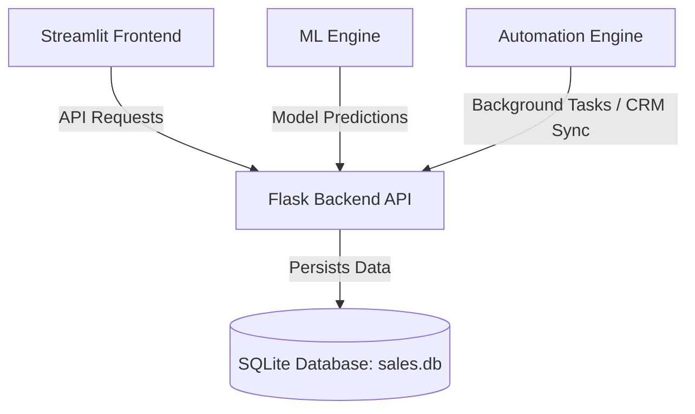

# 🌌 SalesGenie AI (Forgex AI)

SalesGenie AI is an advanced, production-grade agentic lead scoring, outreach generation, and sales pipeline management platform. It leverages machine learning models to analyze lead engagement, predict conversion probabilities, and automate custom workflows and outreach.

---

## 🏗️ Architecture & Component Overview

The project is split into four distinct modules to ensure high cohesion and loose coupling:



1. **Backend API (`backend/`)**: Built with Flask, Flask-SQLAlchemy, and Flask-JWT-Extended to serve CRUD endpoints, user auth, and real-time KPI metrics.
2. **Frontend Dashboard (`frontend/`)**: A multi-page Streamlit application delivering interactive sales analytics, lead scoring visualizations, outreach generators, and follow-up sequence creators.
3. **ML Engine (`ml_engine/`)**: A machine learning workspace for data preprocessing, model training (Random Forest Classifier for lead conversion probabilities), and custom conversational AI features.
4. **Automation Engine (`automation/`)**: Configured for background cron jobs (daily reports, follow-ups, pipeline cleaning), external CRM syncing, and production containerization.

---

## 📁 Project Structure

```text
Forgex_AI/
│
├── automation/                 # Background tasks, CRM integrations, and deployments
│   ├── api/                    # Automation and CRM sync API routes
│   ├── background_jobs/        # Scheduled worker tasks (daily reports, outreach emails, cleaners)
│   ├── deployment/             # Containerization assets (Dockerfile, docker-compose, nginx, render.yaml)
│   └── requirements.txt        # Automation dependencies
│
├── backend/                    # Core Flask REST API & database configuration
│   ├── app/                    # Primary Flask app models and initialization
│   ├── models/                 # SQLAlchemy User and Lead schema models
│   ├── routes/                 # Segmented API blueprints (auth, leads, KPIs)
│   ├── utils/                  # Security wrappers and utilities
│   ├── database.py             # Database connections and session managers
│   ├── app.py / auth_jwt.py    # Legacy entrypoint and JWT helpers
│   └── requirements.txt        # Backend dependencies
│
├── frontend/                   # Streamlit interactive user interface
│   ├── Home.py                 # Multi-page Streamlit entrypoint
│   ├── assets/                 # Custom styling CSS and client-side JS charts
│   ├── components/             # Reusable UI widgets (KPI cards, charts, tables)
│   ├── pages/                  # Streamlit pages (Analytics, Scoring, Sales Intelligence, Outreach)
│   ├── utils/                  # API client wrapper and session authentication manager
│   └── requirements.txt        # Frontend dependencies
│
├── ml_engine/                  # Predictive modeling and ML workspace
│   ├── core/                   # Preprocessing, training, lead scoring, and outreach logic
│   ├── config/                 # Machine learning pipeline configuration
│   ├── data/                   # Raw and processed datasets
│   ├── notebooks/              # Model exploration and training Jupyter Notebooks
│   └── requirements.txt        # ML dependencies
│
├── sales.db                    # SQLite Database
└── README.md                   # Project documentation (this file)
```

---

## 🚀 Key Features

### 1. Secure Authentication Flow
* JWT-driven user registration, login, and secure session management.
* Dynamic client-side routing on the Streamlit frontend based on auth state.

### 2. Multi-Page Analytical Dashboard
* **KPI Overviews**: Track pipeline value, conversion rates, and average sales cycles.
* **Lead Scoring Visualizations**: High-fidelity charts showing distribution of Hot, Warm, and Cold leads.
* **Sales Intelligence**: Detailed breakdown of leads by industries and custom parameters.

### 3. AI-Powered Outreach Generator
* Generates customized outreach emails using lead classification and contextual attributes.
* Formulates automated follow-up sequences based on engagement history.

### 4. Background Job Scheduling
* Automated daily sales reports generation.
* Cleaners to automatically archive or flag dormant sales pipelines.
* CRM synchronization endpoint wrappers.

---

## 🛠️ Installation and Setup

### Prerequisites
* Python 3.10 or higher.
* Docker (Optional, for containerized deployments).

### 1. Backend Server Setup
Navigate to the `backend/` directory, set up your environment, and start the Flask service:
```bash
cd backend
python -m venv .venv
# Activate virtual environment
# Windows:
.venv\Scripts\activate
# macOS/Linux:
source .venv/bin/activate

pip install -r requirements.txt
python app/main.py
```
*The API server will run locally at `http://127.0.0.1:5000`.*

### 2. Streamlit Dashboard Setup
Open a new terminal session, navigate to the `frontend/` directory, set up the environment, and run the Streamlit app:
```bash
cd frontend
python -m venv .venv
# Activate virtual environment
# Windows:
.venv\Scripts\activate
# macOS/Linux:
source .venv/bin/activate

pip install -r requirements.txt
streamlit run Home.py
```
*The dashboard will launch in your browser at `http://localhost:8501`.*

### 3. Running Background Automation Tasks
Navigate to the `automation/` directory, setup the environment:
```bash
cd automation
python -m venv .venv
# Activate virtual environment
# Windows:
.venv\Scripts\activate
# macOS/Linux:
source .venv/bin/activate

pip install -r requirements.txt
# Run background scheduler daemon
python background_jobs/scheduler.py
```

---

## 🔌 Core API Reference

### 🔐 Authentication
* **`POST /api/auth/register`**: Registers a new user/agent.
* **`POST /api/auth/login`**: Authenticates credentials and returns a JWT token.

### 📈 Lead Management
* **`GET /api/leads`**: Lists all active sales leads.
* **`POST /api/leads`**: Adds a new lead record.
* **`PUT /api/leads/<id>`**: Updates an existing lead's attributes or sales stage.
* **`DELETE /api/leads/<id>`**: Removes a lead from the tracking system.

---

## 🐳 Containerization & Deployment

To build and run the entire suite using Docker Compose:
```bash
cd automation/deployment
docker-compose up --build
```
This launches:
* The Flask Backend API container on port `5000`.
* Nginx as a reverse proxy on port `80` routing frontend and backend components.
